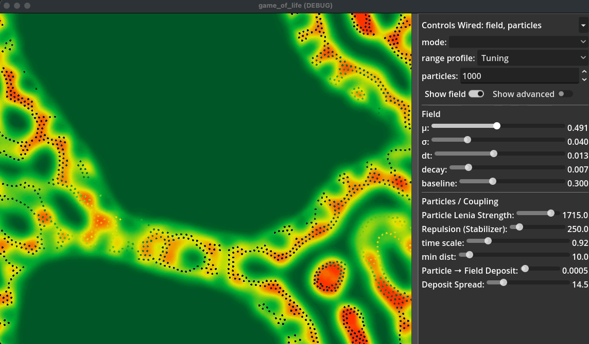

> ** Author Note ** 
Hey! This project was 100% AI assisted work that was inspired by a conversation with Claude (OPUS4.5) and ChatGPT (5.1-5.2). I am constantly deep diving into hard subjects that I can only rely on my intuition as Claude and GPT do thier best to explain these very complicated subjects. 
This project is the result of that curiousity, the development of colloboration scripts for Claude and ChatGPT and deep conversations with the two (and between the two LLMs) as well as a coding agent locally.
I almost stopped several times as it did get complicated very quickly as I have never really built in GODOT or this kinda simulation. Lots of knowledge earned and curiosity itched. 
___
# Double Lenia (Godot)

A GPU-accelerated **two-system Lenia** simulation in Godot 4: **particles evolve via Lenia growth in continuous particle-space** (the primary driver), **a 2D grid field evolves via Lenia growth**, and the two are **weakly, asymmetrically coupled**—particles shape the field strongly; the field influences particles only slightly.

## How this happened

Started at Conway’s Game of Life → followed the trail into Lenia → and kept poking one question:

*"Why is the kernel a donut?"*

That turned into a particle variant (continuous space, discrete agents), and eventually into the current form: **two Lenia systems running at once**, each doing “Lenia things” in its own domain, with a deliberately constrained coupling between them.

## What this is

**Two coupled Lenia systems:**

- **Particle Lenia-like system (primary driver):** particles compute a Lenia neighborhood value in particle-space and move according to the **Lenia growth gradient** (ring-kernel + growth function), with repulsion as a stabilizer.
- **Field Lenia (grid):** a 2D field evolves on a grid via Lenia convolution + growth.
- **Coupling is weak + asymmetric:**
  - **Particles → Field (dominant):** particles **deposit** into the field (Gaussian splats).
  - **Field → Particles (weak):** field samples **modulate particle μ locally** (`mu_locals`) by a small amount. With `mu_range = 0`, the field does not influence particles.



## What emerges

Without scripting behaviors:
- Ring / shell structures
- Multiple distinct “organisms” that maintain separation
- Nested equilibrium layers
- Merging / splitting / settling into stable configurations
- Field features that persist because particles continuously reinforce them

## Core math (high level)

### Particle-space neighborhood
Each particle sees a neighborhood value from other particles through a ring kernel:

```

U_i = (1/N) Σ K(|p_i - p_j|)

```

Growth (with local μ):

```

G(u; μ, σ) = 2·exp(-(u - μ)² / (2σ²)) - 1

```

Motion is driven by the analytic gradient of growth:

```

v_i ∝ ∇G(U_i)

```

Repulsion prevents collapse at short distances:

```

R_i = Σ (1 - d/min_dist)² · direction

```

### Grid field evolution
The grid field evolves via convolution with a ring kernel and a growth function, clamped to [0, 1].

### Coupling
Particles deposit into the field:

```

field += deposit_amount · exp(-|x - p_i|² / (2·deposit_radius²))

```

Field weakly modulates particle μ:

```

μ_i = clamp(mu_base + mu_range · map(field(p_i)), 0, 1)

```

## Built with

- **Godot 4.x**
- **GPU compute shaders** (particles + deposit + field evolution)
- A conversation between me and a coding agent

## Controls that matter

### Particle (primary)
- `particle_kernel_radius`, `particle_kernel_width` — ring kernel shape
- `particle_sigma` — growth width
- `gradient_strength` — Particle Lenia-like strength
- `repulsion_strength`, `min_dist` — stabilizer terms
- `time_scale`, `max_speed`, `velocity_smoothing` — integration/limits

### Field (grid Lenia)
- `field_mu`, `field_sigma`
- `field_kernel_radius`, `field_kernel_width`
- `field_dt`, `field_decay`, `field_baseline`
- `grid_resolution`

### Coupling (explicit + directional)
- **Particles → Field:** `deposit_amount`, `deposit_radius`
- **Field → Particles:** `mu_range` (strength), `mu_base` (center)  
  `mu_range = 0.0` disables field → particle influence.

## License

MIT
