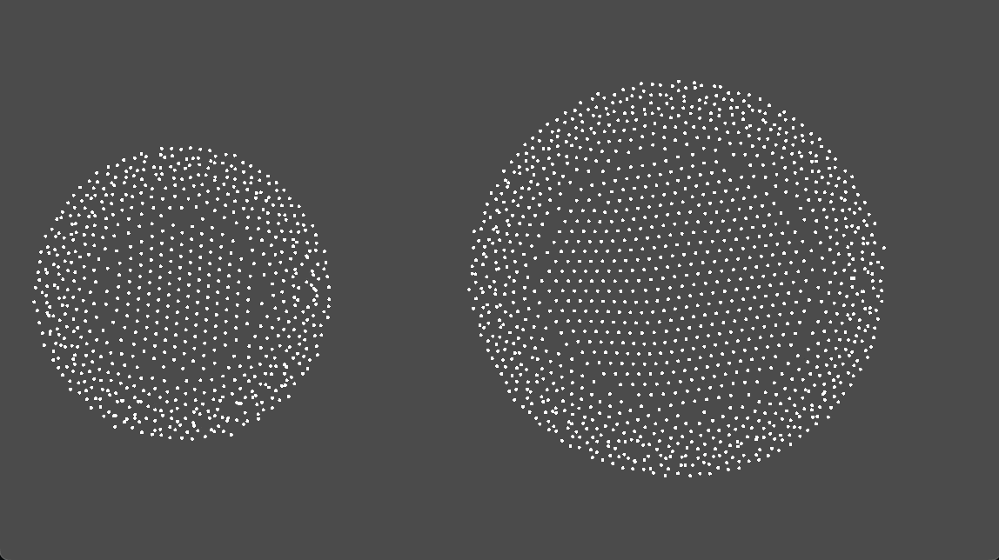
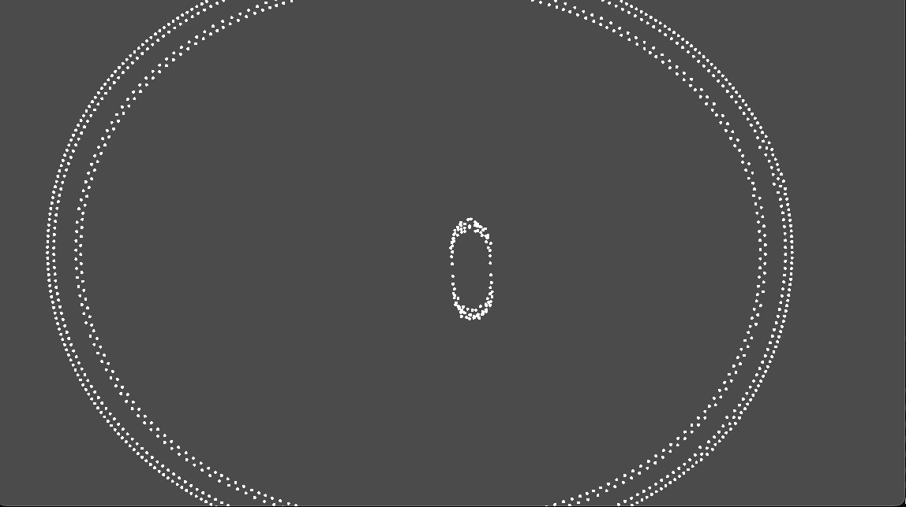
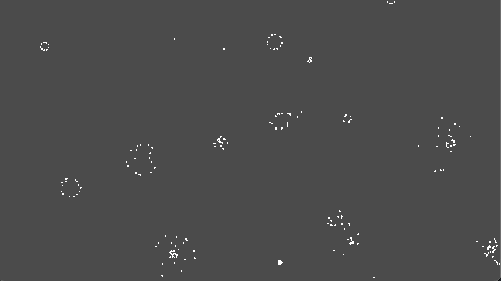

# Particle-Lenia Presets

A compact table listing presets, settings, and previews.

---

## **Preset Table**

| Preset        | Particle Count | Min Dist  | Kernel | Mu      | Sigma  | Gradient | Repulsion | Time Scale | Preview                |
| ------------- | -------------- | --------  | ------ | ------- | ------ | -------- | --------- | ---------- | ---------------------- |
| **Preset 01** | `2000`         | `9.0`     | `40.0` | `0.04` | `0.02` | `300.0`  | `-1.0`    | `5.0`      |  |
| **Preset 02** | `2000`         | `15.0`    | `50.0` | `0.04` | `0.02` | `750.0`  | `75.0`    | `5.0`      |  |
| **Preset 03** | `1211`         | `15.0`    | `50.0` | `0.04` | `0.02` | `15500.0`  | `50.0`    | `5.0`      |  |
| **Preset 03** | `600`         | `7.0`    | `25.0` | `0.04` | `0.02` | `20000.0`  | `-1.0`    | `5.0`      |  |

---
